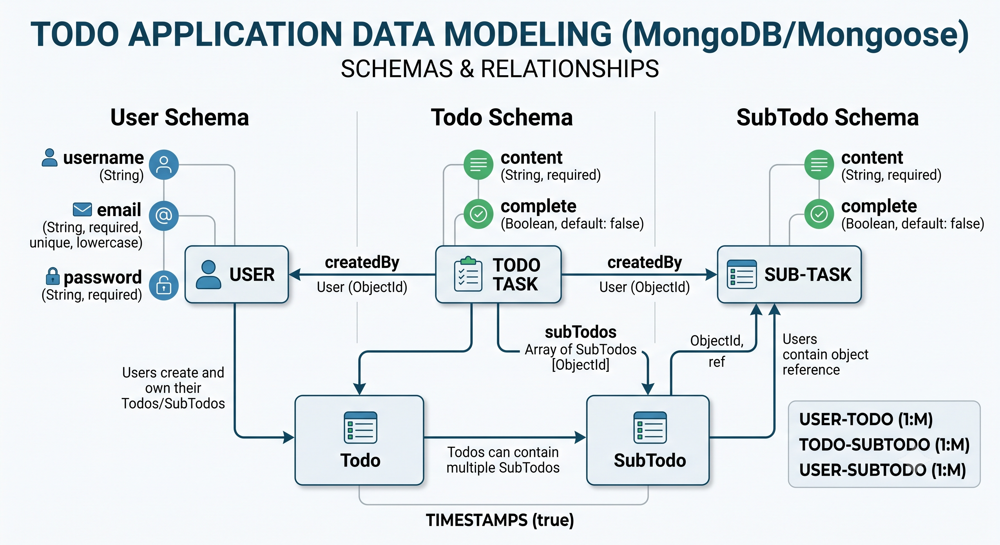
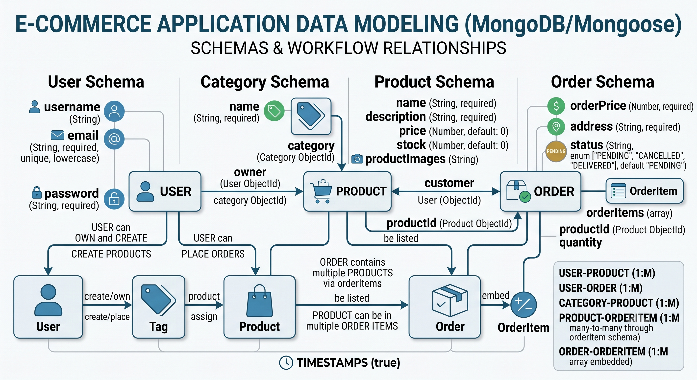

# Backend Development Practice

Here, I started with `npm init` for practice to create `package.json`.

Then, I learned about **Mongoose**, which is used for data modeling. I practised by building two data models: **Todo** and **Ecommerce**.

- **Todo** → 
- **Ecommerce** → 

Mongoose is an object-oriented modeling tool for **MongoDB** in JavaScript. It helps you define schemas, enforce structure, validate data, and perform CRUD operations easily, making MongoDB development more organized and predictable.

## What Mongoose Does

- **Schema-based modeling:** MongoDB is schema-less, but Mongoose lets you define schemas for collections, ensuring consistency.
- **Validation and type casting:** Automatically validates data types such as `String`, `Number`, `Date`, and `Boolean` before saving.
- **CRUD operations:** Provides simple methods for **Create**, **Read**, **Update**, and **Delete**.
- **Middleware and hooks:** Lets you run logic before or after operations, such as hashing passwords before saving.
- **Query building:** Provides a rich syntax for filtering, sorting, and projecting results.